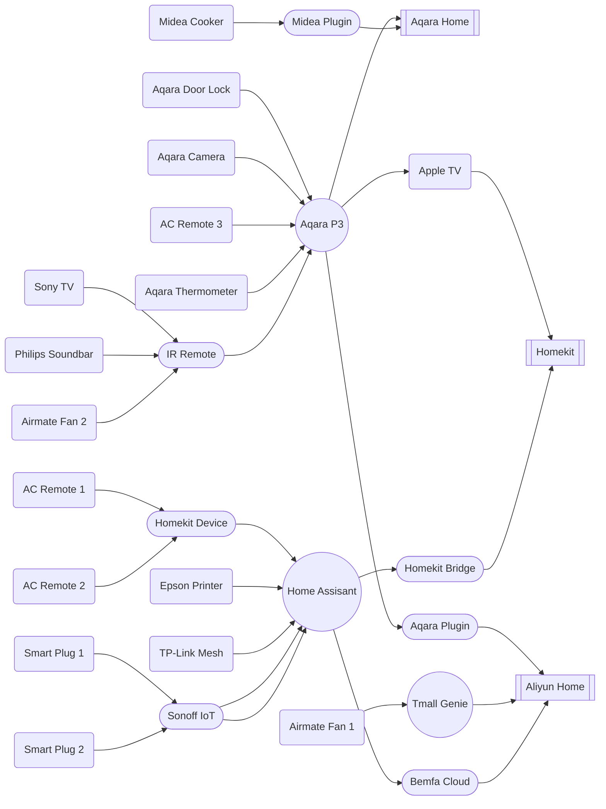

```mermaid
graph LR
    dl(Aqara Door Lock) --> p3((Aqara P3)) --> ah[[Aqara Home]]
    cam(Aqara Camera) --> p3
    ac3(AC Remote 3) --> p3
    tm(Aqara Thermometer) --> p3
    p3 --> atv(Apple TV) --> hk[[Homekit]]
    p3 --> ap([Aqara Plugin]) --> ali
    tg((Tmall Genie)) --> ali[[Aliyun Home]]
    fan1(Airmate Fan 1) --> tg
    ha((Home Assisant)) --> hb([Homekit Bridge]) --> hk
    ac1(AC Remote 1) --> hd([Homekit Device]) --> ha
    ac2(AC Remote 2) --> hd
    pt(Epson Printer) --> ha
    rt(TP-Link Mesh) --> ha
    ck(Midea Cooker) --> mp([Midea Plugin]) --> ah
    ha --> bc([Bemfa Cloud]) --> ali
    tv(Sony TV) --> ir([IR Remote]) --> p3
    sb(Philips Soundbar) --> ir
    fan2(Airmate Fan 2) --> ir
    pl1(Smart Plug 1) --> si([Sonoff IoT]) --> ha
    p2(Smart Plug 2) --> si --> ha
```
